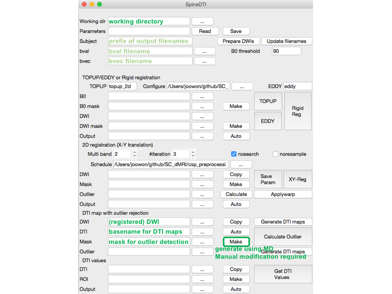

# `sping_reg_gui.py`

1. [initial setup](#initial-setup)
    - [prepare DWIs](#initial-setup---prepare-dwis)
2. [topup and eddy](#topup-and-eddy)
    - [topup](#topup)
    - [eddy](#eddy)
3. [registration](#registration)
    - [x-y translation](#registration---x-y-translation)
4. [DTI](#dti)
    - [outlier selection](#dti---outlier-selection)

`$ spine_reg_gui.py [parameter_filename]`

This is the main windows. It has 5 parts.
In general,
- button `Auto` generates a filename. 
- button `Copy` copies a filename from a previous section.
- button `...` opens a window to select a file.

## initial setup

- `Working dir`: by default, the directory where you start the program. All outputs will be in the directory.
- `Parameters`: filename to save/load parameters.
- `Subject`: subject id. It will be used as prefix of output filenames.
- button `Prepare DWIs`: it will open another windows to merge/concatenate files.
- button `Update filenames`: not implemented.
- `bval`: concatenated bval filename. will be autogenerated after `Prepare DWIs`.
- `bvec`: concatenated bvec filename. will be autogenerated after `Prepare DWIs`.
- `B0 threshold`: threshold value to consider a frame as b0 frame if bval < threshold during registration.

### initial setup - Prepare DWIs
If you click `Prepare DWIs`, it will open another window.

- `Subject`: subject id. It will be used as prefix of output filenames.
- `Output Directory`: usually the same as `Working dir`.
- `Merged B0`: merged (concatenated) b0 filename. will be autogenerated after `Run`.
- `Merged DWI`: merged (concatenated) DWI filename. will be autogenerated after `Run`.
- button `ADD Nifti1 file`: to selected files.
- button `Run`: merge (concatenate) files (Nifti, bval, and bvec).

If you click `ADD Nifti1 file` and add files, the window becomes like:

- radio button `AP PA`: phase-encoding direction.
- checkbox `B0`: check if the file will be used as b0 image. the first frame will be used.
- checkbox `DWI`: check if the file will be used as DWI image.

After add and check all files, press `Run`.

## topup and eddy

### topup

- `TOPUP`: topup excutable filename.
- `Configure`: topup configuration filename.
- `EDDY`: eddy excutable filename.
- `B0`: concatenated b0 filename.
- `B0 mask`: b0 mask filename. We recommend you make each mask for each b0 frame.
- button `Make`: open a GUI for b0 mask drawing.
- button `TOPUP`: run topup.

### eddy

- `EDDY`: eddy excutable filename.
- `DWI`: concatenated DWI filename.
- `DWI mask`: DWI mask filename.
- button `Make`: open a GUI for DWI mask drawing.
- button `EDDY`: run eddy.
- `Output`: eddy result filename. autogenerated.

## registration

- `Multiband`: set 2 or more if you want to group multibanded slices together for registration.
- `#iteration`: nubmer of iteration for registration. default 3.
- checkbox `nosearch`: recommended.
- checkbox `noresample`: recommended if multiband is not used.
- `DWI`: filename to register (if you ran topup/eddy, their result).
- `Mask`: mask filename. Cylinderical mask works well.
- button `XY-Reg`: run registration

### registration - x-y translation

- button `Calculate`: create csv file of x, y translation in mm.
- `Outlier`: not implemented.
- button `Applywarp`: if you made a manual transformation modification, click this.
- `Output`: registered filename. autogenerated.

## DTI
The DTI map generation excluding outliers requires a modified version of 4dfp.

- `DWI`: DWI filename to generate DTI maps. If you ran registration, the result is the filename here.
- button `Generate DTI maps`: using 4dfp.

- `DTI`: basename for DTI maps. autogenerated.
- `Mask`: ROI for outlier calculation. ROI should be inside spinal cord.
- button `Make`: make a mask based on MD. It should be modified manually.

- button `Calculate Outlier`: run outlier selection GUI.

### DTI - outlier selection

The graph shows residual values of frames. Yellow, green, and blue horizontal dashed lines are 1, 2, and 3 times of standard deviation, respectively. A red horizontal line is boxplot outlier.

- `Z`: slice
- button `Read`: read saved outlier.
- button `Save`: save outlier.
- button `Reset`: uncheck all selection.
- checkboxes: check frames what you think outliers.

- `Outlier`: outlier filename. autogenerated after `Calculate Outlier`.
- button `Generate DTI maps`: re-generate DTI maps excluding outliers.

Iterate `Generating DTI maps` and `Calculate Outliers` until there is no outliers.

## DTI values: not implemented
- `DTI`: DTI map basename.
- `ROI`: ROI filename.
- `Output`: output filename.
- button `Get DTI Values`: calculate DTI values on ROI.

